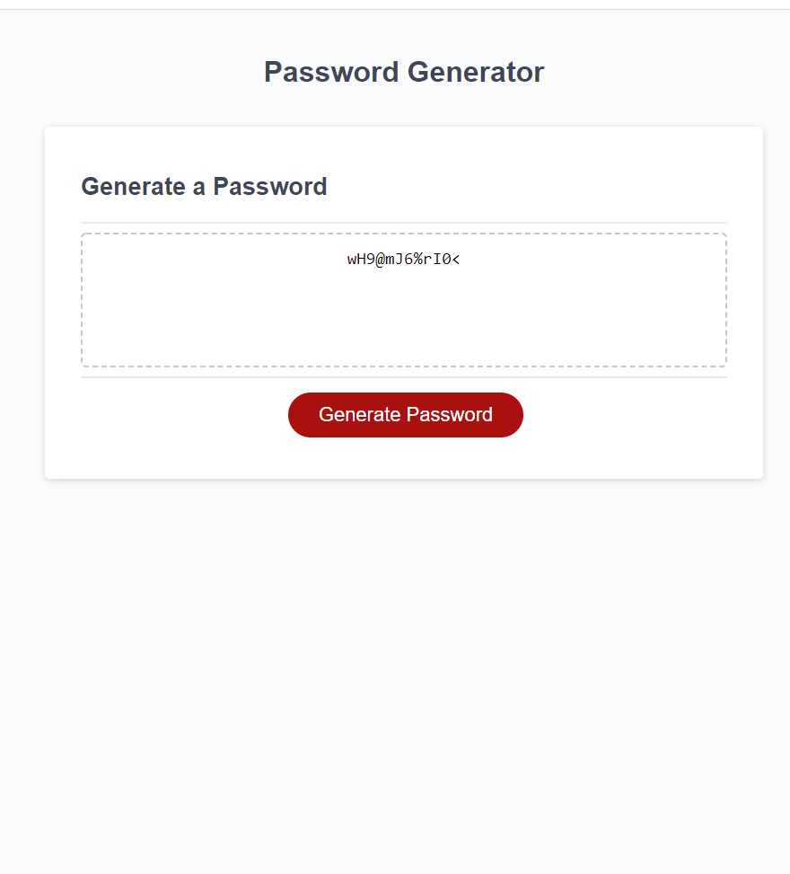

<<<<<<< HEAD:READ.md
#Project Title; Intro to Java Password Generator 
=======
Project Title; Intro to Java Password Generator 
>>>>>>> 7c4f741fed8d49a0d8fb3df1d9183819e4c5442b:readme.md

Description of the App;
The purpose of the generator is to create a unique password after the user selects the desired parameters. Several websites require certain characters to be present in the password for the user to successfully use the password on the website. Taking that into consideration the code needs to be able to filter out characters that might not be acceptable on the website. This generator is limited to selecting lowercase and uppercase lettering, numbers and special characters (!, @, #...etc). The majority of the code used in the project is centred around javascript. 

Build Status; 
The code is all finished and the console.logs are removed from the code to create a clean look to the code. 

Screenshot;
<<<<<<< HEAD:READ.md

=======

>>>>>>> 7c4f741fed8d49a0d8fb3df1d9183819e4c5442b:readme.md

Code Style; 
HTML, CSS & Javascript

Link to the website;
https://nicholasdy.github.io/Intro-to-Java-Random-Password-Generator/.

Credit  - Colombia University Coding Bootcamp
